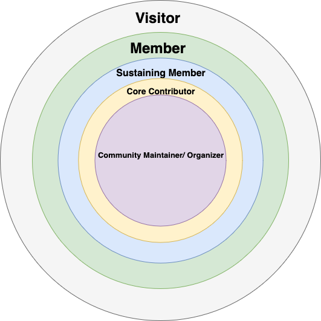

# Community Structure and Goals 

## Goals and Vision
**Purpose-Driven:** A community needs to have a clear purpose that its members believe in and are willing to work towards. This purpose should be communicated clearly and consistently.
**Relationships First:** Relationships are the cornerstone of a strong community. Members should feel connected to one another and be able to trust and support each other.
**Continuous Improvement:** A community should always be looking for ways to improve, both for the individual members and for the community as a whole. This involves regularly evaluating progress and making changes as needed to stay aligned with the community's purpose

### What's the Five Year Plan?
In the immediate term, we're focused on building a network of volunteers, members, and partners. We're also configuring systems and community infrastructure—operationalizing tools to support future chapters with a “community-in-a-box” model for managing donations, partnerships, membership, and more.

Our goal is not only to strengthen our local community but also to expand everyone’s network. We want members to be able to engage with and visit other like-minded communities, creating a broader, connected ecosystem of collaboration and support.

## Principals of Belonging 

When structuring our community, we heavily consider the **prinicpals of belonging** presented in [The Art of Belonging](https://www.charlesvogl.com/books).

We seek to continoussly ask and improve our answers to these questions:
* What is the boundary to belong in this community?
* How are members initiated (if at all) upon joining the community?
* How involved are people in the community rituals? (e.g. invites to meetings and opportunities to speak)
* How accessible is the community space?
* What are a peoples's values and how do they align with the communities?
* What physical token can we provide to people to remind them of this community and help them bring others into it?
* How clear are the inner rings to people. (outer ring being visiot and inner ring being an elder dedicated and empowered to serve and support the community)

### Inner Rings 
The Inner Rings prinicpal is how somomone enters and then continuest to strengthens their bonds within the community. These rings are a tool to help define boundaries for our community. 

Examples are:  
• Visitor  
• Novice  
• Member  
• Elder  
• Principal Elder  

Or in our case the rings are as follows:

* **Visitor:** Just exploring, no commitment yet.
* **Member:**  Shows up to events, maybe joins the discussion. Has purchased a basic membership. 
* **Sustaining Member** (Time, Talent, or Treasure) Supports the community regularly. Some examples are" 
    * consistent volunteering (time),
    * helping with content/code/logistics (talent)
    * donations (treasure).

**Core Contributor:** Active builders, writers, designers, helpers. Deep commitment to execution — ongoing responsibility. Recognized by peers for meaningful output.

**Community Maintainer/ Organizer** (Leadership)*: Coordinates efforts, mentors others, maintains culture and systems. Often combines multiple contribution types, but focuses on enabling others.

  

#### Why Do We Need Boundaries? 
Check out our [FAQ](/Frequently-Asked-Questions/Why-Boundaries.md)

## Members 

Members will be both organizations and people. We will have tiered memberships. Users may obtain member status through donations of time, currency, or contributions.  (Time, Talent, Treasure) 

### Community Leadership Roles
#### Organizer
#### Community Maintainer 
### Organization Membership

In summary,
We recognize sustaining members for their ongoing support in any form — time, talent, or treasure. Core contributors go a step further by taking ownership of community outcomes. a Commmunity Maintainers is like a community elder — someone who upholds our values, mentors others, and maintains cultural continuity, even if they’re not writing code every day.

### The Board
The board is a leadership role, but it operates outside the inner rings of the community. While it serves and supports the community, it is the innermost circle of active contributors and organizers who ultimately drive outcomes and shape the community’s direction. The board’s primary responsibility is to empower those individuals by securing the resources they need.

Our board members and officers are all volunteers. At this time, no one in the community is paid. We’re committed to ensuring that every dollar of community contributions directly supports growth and meaningful community offerings.

The board also handles:

* Financial stewardship and marketing strategy

* Building and maintaining partnerships

* Community advocacy

* Filling in operational gaps on a day-to-day basis

* Planning and executing events

* Most community operations in coordination with core contributors

The board roles are as follows:
#### President

* Oversees day-to-day operations

* Manages partnerships and external relationships

* Authorized to write checks and purchase property on behalf of the nonprofit

* Works with the Treasurer and board to align funding with community goals

#### Vice President

* Shares all responsibilities of the President

* Serves as acting President in their absence

* Supports coordination of operations and partnerships

#### Treasurer

* Manages all financial matters, including budgeting, reporting, and oversight of funds

* Maintains accurate records of income, expenses, and contributions

* Authorized to write and deposit checks and purchase property on behalf of the nonprofit

* Responsible for acquiring, managing, and recording all types of funding

* Develops and proposes the annual budget, including:

* Projected income (memberships, sponsorships, donations, partnerships)

* Operational and event-related expenses

* nfrastructure costs and contingency funds

#### Other Officers
Additional roles may be defined by the founding team as the organization evolves, based on the needs of the community and strategic initiatives.

#### The Board's Commitment to You

The board has been intentionally composed with diverse expertise to fulfill these responsibilities. While it may hold final decision-making authority when necessary, we are committed to transparency, strong member involvement, and regular communication. Whenever possible, decisions will involve member input and sign-off, ensuring the board remains accountable to the community it serves. We will designate officers, all of whom have to be board members. We can add additional officers should the community or board advocate for it.

## Community Boundaries and Initiation 

## Community Rituals (Common Activites and Shared Traditions)

## Community Space
Taken from [The Good Place](https://en.wikipedia.org/wiki/The_Great_Good_Place_(book))
We as a community strive to be:
* Open and inviting.
* Comfortable and informal.
* Convenient.
* Unpretentious.
* Filled with regulars.
* Driven by conversation
* A place for laughter and joy.

### Physical Spaces
We will provide activites and refreshements, during most events, but a sign of a healthy community is when folks are willing to show up just to be around each other. This is the ultimate goal of our shared community spaces. For where and when we meet, please check out our [Meetup Site]() as well as our [Discord](https://discord.gg/XsHBtnBH)

### Virtual Spaces 
The goals of our virtual spaces are the same as our physical spaces. Our virtual spaces include:
* [AMLC of the Rockies Discord](https://discord.gg/XsHBtnBH)
* [AMLC of the Rockies YouTube Channel](https://www.youtube.com/channel/UC1mzpF-lh7umde3v0cMtKmQ) 
* More to come! 

## Community Symbols and Artifacts 
